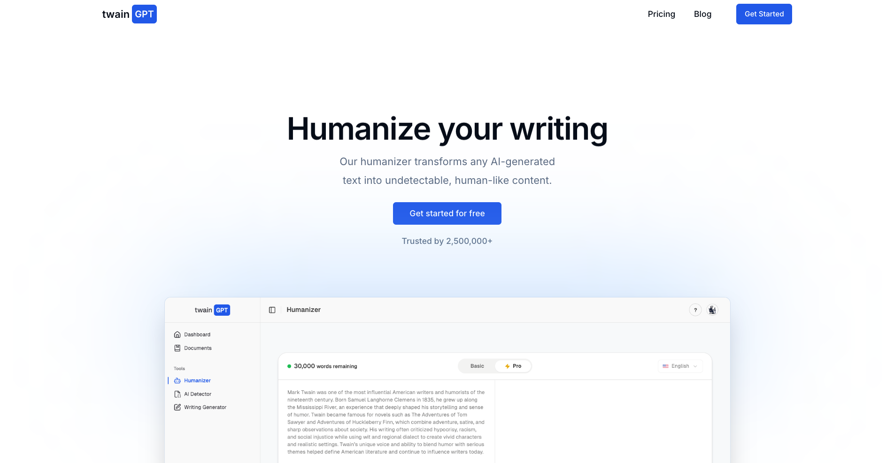
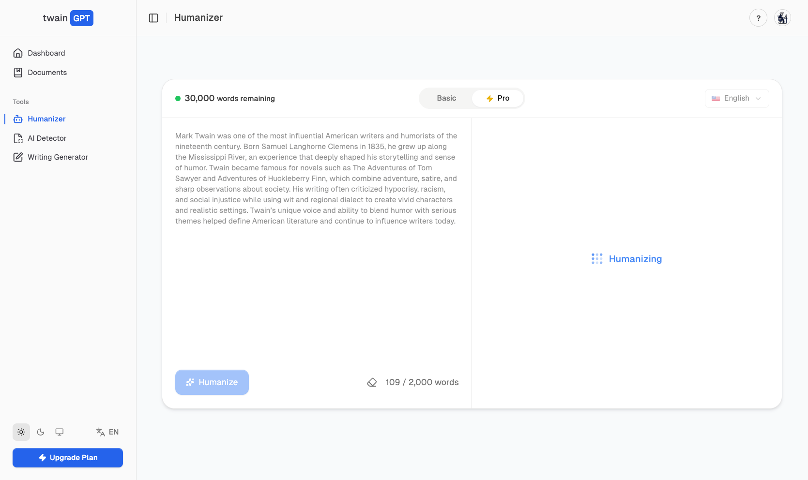

# TwainGPT — AI Humanizer That Bypasses Every AI Detector

If you've ever written something using ChatGPT, Claude, or any other AI tool, you already know the problem. The content is good, but it reads like a robot wrote it. And with AI detectors like Turnitin, GPTZero, and Copyleaks getting smarter every day, that's a real issue for students, writers, and professionals.

That's where TwainGPT comes in. It's an AI humanizer built to do one thing really well: take your AI-generated text and rewrite it so it sounds like a real human wrote it, while bypassing every major AI detector in the process.

## What Is TwainGPT?

TwainGPT is an AI humanizer that transforms AI-generated content into natural, undetectable writing using advanced algorithms. Simply paste your AI text and TwainGPT rewrites it to sound human, bypassing leading detectors like GPTZero, ZeroGPT, Copyleaks, Turnitin, QuillBot, and Grammarly, all without changing the original meaning of your text.

## What Does TwainGPT Do?

TwainGPT rewrites AI-generated text into natural, undetectable writing that bypasses every major AI detector. It also includes an AI detector so you can scan your content from models like ChatGPT, Claude, and Gemini before publishing. The result is clean, human-like content that maintains your original meaning.

## Key Features

- AI humanizer that rewrites AI-generated content to sound human
- Bypasses every major AI detector including GPTZero, ZeroGPT, Turnitin, Copyleaks, QuillBot, and Grammarly
- AI detector to scan content from models like ChatGPT, Claude, and Gemini
- Maintains the original meaning of the text while rewriting
- Supports 100+ languages
- Smooth mobile experience
- Simple paste-and-rewrite workflow

## Who Is TwainGPT For?

TwainGPT is built for anyone who works with AI-generated content and needs it to sound human. Whether you are a student trying to avoid Turnitin flags, a writer producing blog content, a marketer creating copy at scale, or a professional who uses AI as part of their daily workflow, TwainGPT gives you the tools to ensure your writing sounds human and bypasses every AI detector.

## How It Works

Using TwainGPT is straightforward. Paste your AI-generated text into the platform, hit Humanize, and TwainGPT's advanced algorithms get to work. The tool analyzes your content and rewrites it in a way that reads naturally while avoiding the patterns that AI detectors look for. The result is clean, human-like content that maintains your original meaning and passes every major detector.

You can also run your content through the AI detector first to see how it scores before and after humanizing. This gives you full visibility into the process and confidence before you publish or submit anything.

## Is TwainGPT Worth It?

Yes, TwainGPT is worth it for anyone who regularly works with AI-generated content. It reliably rewrites AI text to sound human and bypasses every major detector including Turnitin, GPTZero, and Copyleaks, all without changing your original meaning. Whether you are a student, writer, or marketer, it saves time and removes the stress of getting flagged.

## Is TwainGPT Free to Use?

TwainGPT offers a free plan so you can try the platform before committing to a paid plan. You can humanize AI-generated text and test the results at no cost, making it easy to see if it works for your needs before upgrading.

## TwainGPT Pros and Cons

### Pros

1. **Bypasses Every Major AI Detector** — In testing, TwainGPT was able to bypass major AI detectors including GPTZero, ZeroGPT, Copyleaks, Turnitin, and more.

2. **Clean and Easy to Use** — The interface is straightforward. You paste your content, run it, and get usable output quickly without unnecessary steps.

3. **Maintains the Original Meaning** — TwainGPT refines wording without changing your core message. The structure and intent stay aligned, which is important for academic or professional content.

4. **Natural and Polished Output** — The results feel structured and readable without having to go back and heavily edit the text.

5. **Supports 100+ Languages** — TwainGPT is accessible to a global audience with support for over 100 languages.

6. **Smooth Mobile Experience** — Works seamlessly across devices so you can humanize content on the go.

### Cons

1. **Freemium Model** — TwainGPT operates on a freemium model. You can use it for free, but heavier usage or longer documents will require upgrading to a paid plan.

2. **No Offline Access** — TwainGPT is a web-based platform so you need an internet connection to use it.

## Why TwainGPT Stands Out

The AI humanizer space is crowded, but TwainGPT stands out for a few reasons. It fully supports over 100 languages, making it one of the most accessible humanizers for a global audience. The platform combines both an AI humanizer and an AI detector in one place, removing the need to jump between multiple tools. And the simple paste-and-rewrite workflow means anyone can use it without any learning curve.

Whether you are a casual user or someone who produces content at scale, TwainGPT gives you the tools to ensure your writing sounds human and bypasses every AI detector.

## Get Started

Visit [TwainGPT](https://www.twaingpt.com?ref-donauth) to start humanizing your AI content today.
